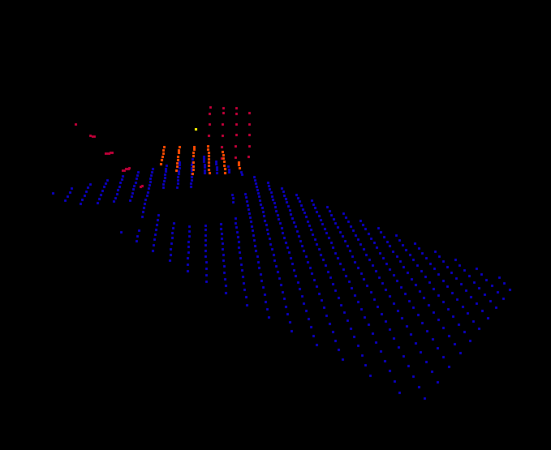

## Installation

When adding this plugin to your project perform the following steps:

* Copy `Plugins/PointCloudGeneratorPlugin` to **your** projects `Plugins` folder
* Delete the `Binaries` and `Intermediate` folders of **your** project folder
* Edit the text in `YOUR_PROJECT_NAME.uproject` to add this newly copied plugin. i.e.
```json
	"Plugins": [
		{
			"Name": "PointCloudGeneratorPlugin",
			"Enabled": true
		}
	]
  ```
* Right Click `YOUR_PROJECT_NAME.uproject` and select `Generate Visual Studio project files`
* Open up your project in Visual Studio, i.e. double click `YOUR_PROJECT_NAME.sln`.
* Rebuild the project. I set the solution platform as "Development Editor"
* Now open up the project in unreal editor. ie double click `YOUR_PROJECT_NAME.uproject`.


## How to use

After adding the plugin you should be able to see the PointCloudGeneratorPlugin C++ Classes available in the File Browser near the bottom of the UnrealEngine Editor.  Simply drag in PointCloudGenerator class (should look like a triggered volume icon) into the world.


This volumetric actor is just a volume that you can size up with the brush settings. Just expand as you would any volume and fill the space that you want the point cloud to be captured. 

There are additional settings that you can change as well:

1. Resolution (cm, unreal units) - How far apart should every point in the point cloud be in the X and Y directions.
2. Show Trace - Show the debug line trace just to make sure its working. Default is off.
3. Record Classes - Record the classes that are hit? Every ray trace can give us information about *what** object was hit, not just position. This can be recorded and saved as a 4'th dimension in the point cloud.
4. Save Directory - What directory should we save to. Defaults to project directory.


Once setting are configured just press the Play button on the editor.  The line trace (ray cast) will begin one second after the play button is pressed and generate the point cloud.  Data will be saved in a 2 dimensional numpy array in the save directory of choice.  A class mapping file is provided as well if Record Classes is checked.

Example plot in matplotlib:


Example plot for large point clouds using plas.io:




## Logging or Errors

Check the console output for any errors or information.


## Visualization

You can visualize the data in python using standard matplotlib data (if the point cloud is not to big. i.e.  < 10,000 points). If its pretty large you will need a GPU accelerated visualizer, e.g. WebGL.  


